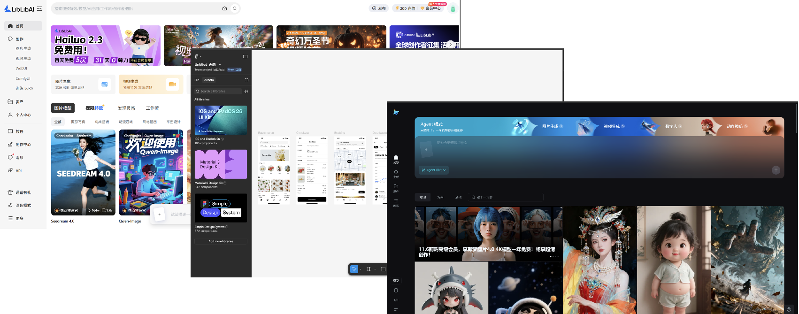

作为python工程师，前端是技术上的短板，最近基于实际企业的需求，尝试着完全使用AI来开发完整的项目，这篇是我开发过程中的一些感想。
项目地址：[链接文字](https://github.com/你的仓库路径)

在开发中一方面感慨现在的AI工具已经非常强大，无论是国外的还是国内的。另一方面无论是像 Trae 这样的代码编辑器，还是网页端的 Chat AI，只要上下文足够清晰，就能生成符合需求的代码。所以我非常认同一句话：做AI垂直化应用，就是在做上下文工程。
这篇文档会尽量的削弱技术方面的知识，更多的关注可落地、可复用的设计逻辑与AI使用方法。

下面是我遵循胡的开发流程：
（1）**交互方式的设计**
    交互方式的设计决定了前端页面的设计方式、数据的展示传输方式以及用户的体验，甚至可以说“**交互即智能**”。所以在设计交互方式时，一定放慢脚步，详细考虑用户的需求和使用场景。
    比如做图片生成网站，是做成libibAI那种大而全的方式，还是以Chat对话的交互方式，还是figma那种工作流的方式。
    

（2）**数据传输与数据存储的方式**
    接着你需要大概清楚，你所需要的数据从哪里来、要做什么、最后要到哪去。
    数据的不恰当处理会在导致后续难以追踪和上下文丢失的严重问题，会导致开发者自己都不知道数据是怎么传输的，数据流具备可理解性、可追溯性，以及可扩展性。
    以我开源的“一致性检查工具”为例，其是利用大模型去分析省级、市级地方政策条款与国家政策条款之间是否存在不合理的“差异”。用户一是需要上传地方或国家文件到相应库中，二是在对比页面选择要对比的地方与国家政策文件。
    
    
    
    有两条主要的数据流：
        1. 一是文档预处理数据流。数据来源于用户的上传，文档文字提取使用的是智谱官方的文档解析工具，文档分块使用本地算法，最后保存至数据库和本地文件夹下。
        2. 二是大模型调用数据流。数据同样来源于用户的选择，用户选择对比的文件，从本地数据路中取相应文件分块内容，调用qwen大模型分析处理，最后结果返回给前端。
    实际的数据设计方案接住了AI生成：

（3）**vibe coding**
    将前面两步的思考写下来，交给AI，首先让他给到合适的技术框架，可以是前后端分离的、也可以是一体化的，这块不需要过于了解，主要的是将这步的结果留存。
    有了技术框架，就可以让AI开始设计前端了，将前端的大致功能都要实现出来，展示的假数据也无妨，主要是考虑实际的交互是否可行。
    现在你是一个真正的项目经理，逐项的列出你想要实现的功能了，再挨个让大模型去实现。每一步需要什么样的数据、数据需要怎样处理、最后要展示什么样的结果，都尽可能的附上，避免大模型检索的失败。
    

（4）**高密度小迭代**
    基于AI的改动具有显著的速度优势，为了提供系统的稳定性，每次的改动尽可能的小迭代，每轮的迭代都尽可能的留存，对后续的复盘与回退至关重要。

几处感想：
（1）AI处理步骤要留存
    当你需要做较大改动时，最后让大模型把处理逻辑、改动的地方、数据的输入输出等变化都写下来保存好。当你开新对话时，这些留存的文档就是大模型最好的参考资料。
（2）AI很强，但还不够
    无论国内国外，顶级大模型的能力差距在快速缩小，只要任务目标清楚，AI就能充分发挥实力。
    但要说完全替代人工，还远远不够。行业和企业的专业知识往往数据化不足，很难直接喂给AI，还得靠人在提示词中补充说明。对于复杂项目和复杂功能，AI从0到1生成的代码往往特别冗长，逻辑不够清晰，给人工复盘和检查增加了难度。
    AI就像一个莽撞的天才，还需要我们这些老家伙看着点。
（3）数据存储设计极其重要
    好的数据存储设计能大大降低后续的开发难度。数据的设计方案和存储方案同样可以让大模型来做，形成设计文档保存好。
（4）优秀的提示词什么样
    提示词就像餐饮店的秘密配方，家家都有一套,但其实都差不多。
    评价提示词好不好，有个简单标准：站在新人的角度，一次能不能完全看懂。如果你从新人角度第二遍读自己的提示词，能清楚理解你的需求，那就是好提示词。
（5）及时制止
    越到后面，代码量和文件数量越来越多，大模型的开发难度也在增加。如果你发现大模型钻牛角尖了，始终理解不到你的需求，请果断喊停，回退到上一个版本。别跟它死磕，浪费时间。
