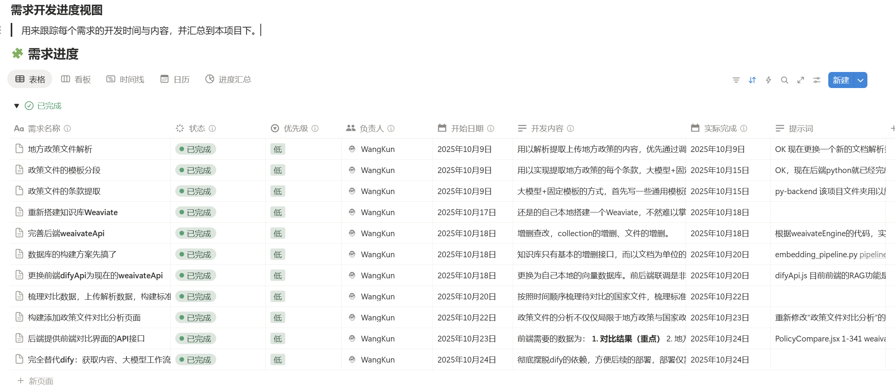
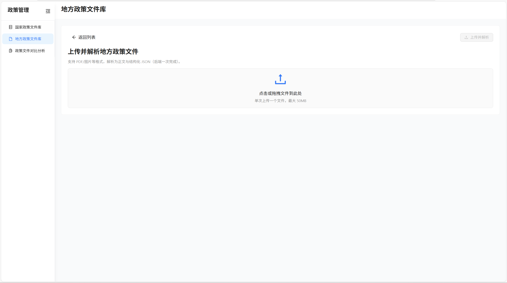
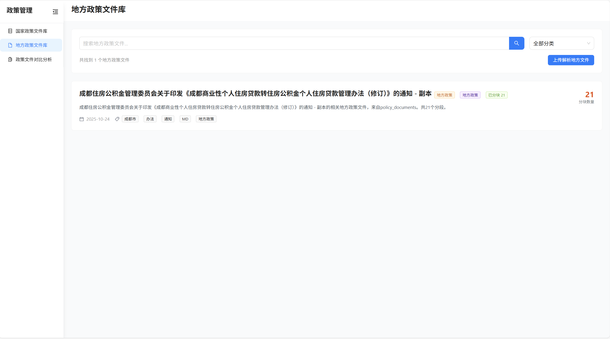
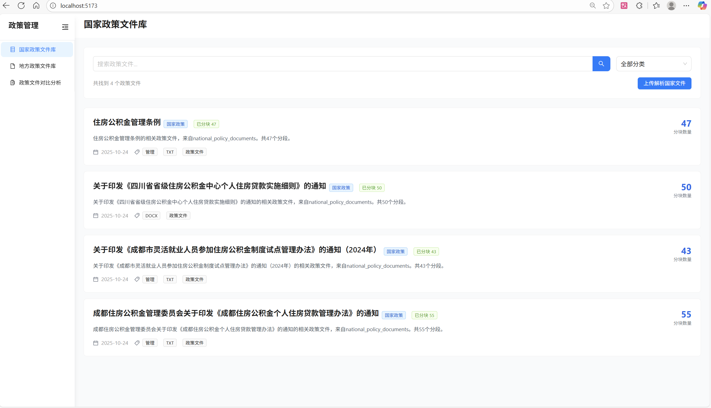
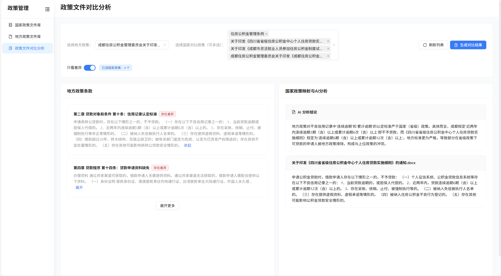

# 项目概要
这是一个基于真实的企业需求而构建的演示项目，名为“政策规则一致性检查”，是用以解决省级、市级所制定的政策规则是否与国家层面的政策规则相冲突或违背。
该项目是一个框架类项目，一是用以验证该需求的真实可行性，提供一个实际的解决方案MVP。二是该项目是通过Trae AI GPT5全称程构建的，同时用以验证AI的辅助实用性与使用逻辑方法。
从10月9日开始，利用空闲业余时间开发，10月24日基本完成总体框架，历时15天完成从概念到雏形全部落地。



## 项目架构
前端支持上传/浏览/对比，本地或生产后端提供解析与向量检索服务，结合 Weaviate 与外部解析服务完成端到端流程。
- 前端：React + Vite + Ant Design + Tailwind
- 后端：FastAPI（Python），Weaviate 客户端，SQLite 持久化，智谱文档解析，SiliconFlow 向量化

## 功能概览
- 上传并解析政策文件：一次性完成解析、切分、向量化与持久化（`/api/rag/ingest-and-index`）
- 政策文件库：国家与地方政策列表、详情、分段数据查看
- 一致性对比：地方政策条款与国家政策条款的差异分析（`/api/compare/analyze`）
- RAG 检索：基于 Weaviate 的混合/向量搜索（`/api/rag/search`、`/api/weaviate/search`）

## 用户操作逻辑
1. 上传政策文件：用户在前端上传地方政策文件和国家政策文件。
2. 解析与索引：后端接收文件后，利用智谱文档解析服务读取文件内容，提取条款、向量化后存储到 Weaviate RAG 中。
3. 查看政策文件库：用户可以在前端查看已上传的政策文件列表，点击文件可查看详细内容。
4. 对比分析：用户选择需要对比的地方政策条款与国家政策条款，后端调用 Weaviate 进行向量检索，通过大模型加以分析返回对比分析结果。

## 实际效果
随机找的成都商业性个人住房贷款政策文件为例。
### 上传并解析政策文件

### 地方政策文件库

### 国家政策文件库

### 实际对比效果


## 目录结构

```
policy-consistency-check/
├── fronted/                # 前端（React + Vite）
│   ├── src/                # 页面与 API 封装
│   ├── .env.example        # 前端环境变量示例（VITE_ 前缀）
│   └── vite.config.js      # 本地开发代理到 Python 后端
└── py-backend/             # 后端（FastAPI）
    ├── api/                # 外部服务与 Weaviate 封装
    ├── router/             # FastAPI 路由（rag、weaviate、compare 等）
    ├── src/                # 业务模块（settings、weaviateEngine 等）
    ├── .env.example        # 后端环境变量示例
    └── app.py              # 应用入口（uvicorn 启动）
```

## 方案设计思路
详细的方案设计请参考：[核心方案设计](核心方案设计.md)

## 快速开始

### 1) 启动后端（Python / FastAPI）

- 创建并激活虚拟环境后安装依赖（示例）：

```bash
pip install -r requirements.txt
```

- 配置环境变量：复制 `py-backend/.env.example` 为 `py-backend/.env`，填写至少以下项：
  - `SILICONFLOW_API_TOKEN`：硅基流动的Token，可更换为任何支持OpenAI接口的向量化服务。
  - `WEAVIATE_API_KEY`：Weaviate 访问密钥，需要安装docker weaviate服务。
  - `ZHIPU_API_TOKEN`：智谱文档解析 Token，可以更换为其它第三方提取文字内容的服务。
  - 如需修改 Weaviate 连接或服务端口，按需覆盖对应变量或代码

- 启动：

```bash
python py-backend/app.py
# 或者：uvicorn app:app --host 0.0.0.0 --port 10010
```

后端默认监听 `APP_HOST=0.0.0.0`，`APP_PORT=10010`（可在 `.env` 中修改）。

### 2) 启动前端（React + Vite）

```bash
cd fronted
pnpm install
cp .env.example .env  # 按需填写变量
pnpm run dev
```

- 本地开发代理：`/api/*` 将被代理到后端（`DEV_PROXY_TARGET`，默认 `http://127.0.0.1:10010`）。
- 生产部署：设置 `VITE_API_BASE_URL`（后端域名）与 `VITE_API_BASE_PREFIX`（通常 `/api`）。

## 环境变量与配置

### 前端（Vite）

- `VITE_API_BASE_URL`：后端地址 Origin（留空表示同源）
- `VITE_API_BASE_PREFIX`：后端路由前缀（默认 `/api`）
- `VITE_TARGET_DATASET_ID`：国家政策集合名（默认 `national_policy_documents`）
- `VITE_LOCAL_DATASET_ID`：地方政策集合名（默认 `policy_documents`）
- `DEV_PROXY_TARGET`：开发代理目标（默认 `http://127.0.0.1:10010`）

> 注意：所有以 `VITE_` 前缀的变量会被构建到客户端，请勿放置敏感信息。

### 后端（FastAPI）
- 服务：`APP_HOST`、`APP_PORT`
- 集合：`DEFAULT_COLLECTION_NAME`（默认 `policy_documents`）
- SiliconFlow：`SILICONFLOW_API_TOKEN`
- Weaviate：
  - `WEAVIATE_HTTP_HOST`、`WEAVIATE_HTTP_PORT`、`WEAVIATE_HTTP_SECURE`
  - `WEAVIATE_GRPC_HOST`、`WEAVIATE_GRPC_PORT`、`WEAVIATE_GRPC_SECURE`
  - `WEAVIATE_API_KEY`
- 智谱 BigModel：`ZHIPU_API_TOKEN`、`ZHIPU_UPLOAD_URL`、`ZHIPU_RESULT_BASE`
- 存储根目录（可选）：`STORAGE_ROOT`（默认 `<project>/storage`）

> 后端通过 `src/settings.py` 统一读取环境变量，`app.py` 在启动时加载 `.env`。

## 主要 API（摘要）
- 解析与入库
  - `POST /api/rag/ingest-and-index`：上传文件 → 解析 → 切分 → 向量化 → 持久化
  - `GET  /api/rag/documents?collection_name=...`：列出集合中文档
  - `GET  /api/rag/documents/{doc_id}/chunks`：列出分段（供前端详情页）
  - `GET  /api/rag/documents/{doc_id}/parsed`：获取解析产物（正文、目录、计数、关键词）
- 一致性对比
  - `POST /api/compare/analyze`：输入地方文档与多个国家文档 ID，返回条款级对比结果
- Weaviate 检索
  - `POST /api/weaviate/search`：混合/向量搜索（支持 filters 与条件组合）

## 数据存储与向量库

- 持久化目录结构（默认 `storage/`）：
  - `storage/docs/<collection_id>/<doc_id>/raw/` 原始文件
  - `storage/docs/<collection_id>/<doc_id>/parsed/` 解析产物（`content.txt`、`toc.json`、`segments.json`、`keywords.json`）
- 数据库（SQLite）：`collections`、`documents`、`chunks` 等表，记录文档元信息与向量化状态。
- 向量库：Weaviate，封装于 `src/weaviate/weaviateEngine.py` 与 `api/weaivateApi.py`。
